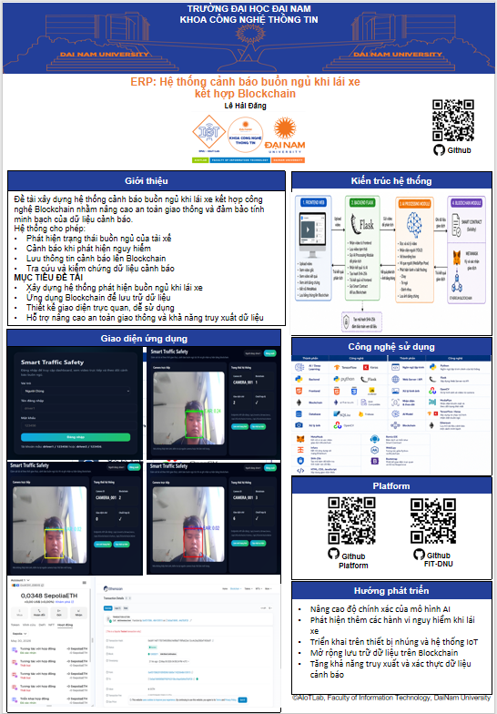
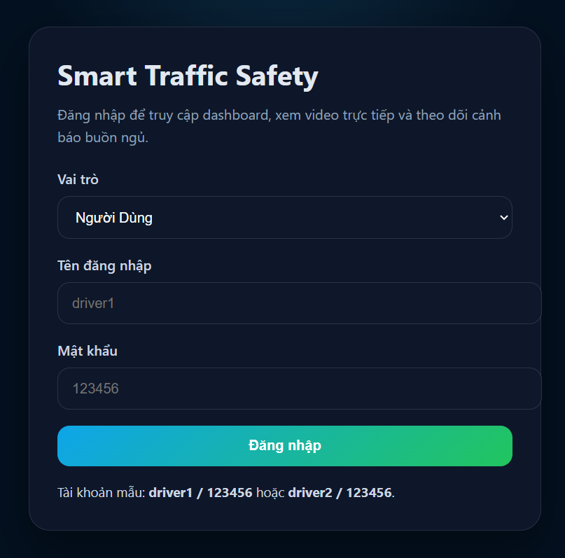
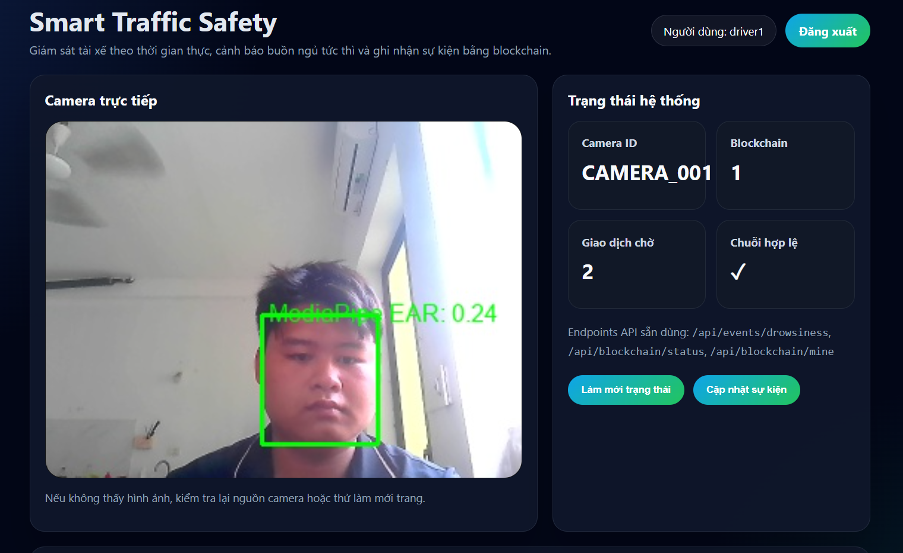
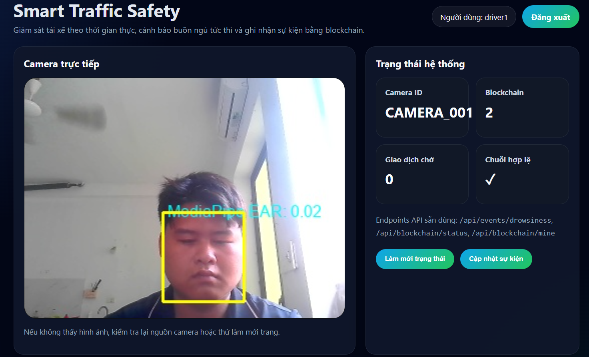
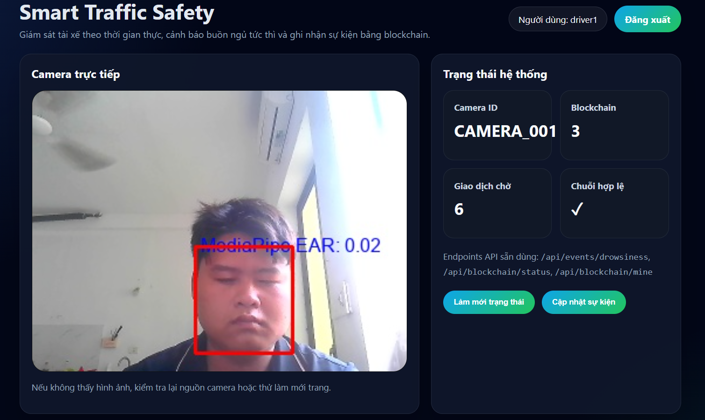
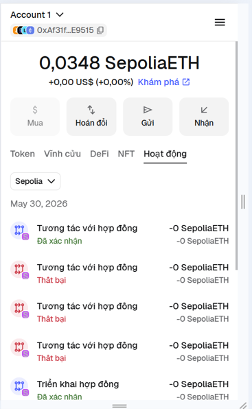

<h2 align="center">
    <a href="https://dainam.edu.vn/vi/khoa-cong-nghe-thong-tin">
    🎓 Faculty of Information Technology (DaiNam University)
    </a>
</h2>
<h2 align="center">
     HỆ THỐNG CẢNH BÁO BUỒN NGỦ KHI LÁI XE KẾT HỢP BLOCKCHAIN
</h2>
<div align="center">
    <p align="center">
        
        
        
    </p>

[](https://www.facebook.com/DNUAIoTLab)
[](https://dainam.edu.vn/vi/khoa-cong-nghe-thong-tin)
[](https://dainam.edu.vn)

</div>
---

# 📖 1. Giới thiệu hệ thống

## 🚗 Hệ thống cảnh báo buồn ngủ khi lái xe kết hợp Blockchain

Tai nạn giao thông do tài xế mất tập trung hoặc buồn ngủ là một trong những nguyên nhân gây thiệt hại lớn về người và tài sản. Đề tài xây dựng hệ thống giám sát trạng thái người lái xe bằng công nghệ xử lý ảnh kết hợp Blockchain nhằm phát hiện sớm dấu hiệu buồn ngủ và lưu trữ dữ liệu cảnh báo một cách minh bạch, an toàn.

Hệ thống sử dụng camera để theo dõi khuôn mặt tài xế, phân tích trạng thái mắt và khuôn mặt theo thời gian thực. Khi phát hiện dấu hiệu buồn ngủ, hệ thống sẽ phát cảnh báo và lưu thông tin sự kiện lên Blockchain thông qua Smart Contract.

---

# 🏗️ Kiến trúc hệ thống

## 📷 Camera Monitoring

* Thu nhận hình ảnh khuôn mặt người lái xe.
* Gửi dữ liệu đến hệ thống xử lý.

## 🤖 AI Processing Module

* Phát hiện khuôn mặt.
* Theo dõi trạng thái mắt.
* Tính toán EAR (Eye Aspect Ratio).
* Nhận diện trạng thái buồn ngủ.
* Kích hoạt cảnh báo.

## ⛓️ Blockchain Module

* Tạo mã hash SHA-256 cho dữ liệu cảnh báo.
* Ghi nhận sự kiện lên Blockchain.
* Đảm bảo tính toàn vẹn dữ liệu.
* Hỗ trợ truy xuất và kiểm chứng lịch sử cảnh báo.

## 🌐 Web Dashboard

* Hiển thị trạng thái hệ thống.
* Kết nối MetaMask.
* Theo dõi lịch sử cảnh báo.
* Lưu dữ liệu lên Blockchain.

---

# 🚀 2. Chức năng chính

## 👁️ Giám sát trạng thái người lái

* Theo dõi khuôn mặt theo thời gian thực.
* Phát hiện mắt mở hoặc nhắm.
* Tính toán chỉ số EAR.

## ⚠️ Cảnh báo buồn ngủ

* Phát hiện mắt nhắm trong thời gian dài.
* Cảnh báo bằng âm thanh.
* Hiển thị trạng thái nguy hiểm trên giao diện.

## 📸 Lưu ảnh bằng chứng

* Chụp ảnh tại thời điểm phát hiện buồn ngủ.
* Lưu trữ phục vụ kiểm tra sau này.

## 🔐 Tạo mã hash SHA-256

* Sinh mã băm cho dữ liệu sự kiện.
* Kiểm tra tính toàn vẹn của dữ liệu.

## ⛓️ Lưu dữ liệu lên Blockchain

* Kết nối MetaMask.
* Ký giao dịch Blockchain.
* Ghi nhận sự kiện thông qua Smart Contract.

---

# 🛠️ 3. Công nghệ sử dụng

| Công nghệ           | Vai trò                    |
| ------------------- | -------------------------- |
| Python              | Xây dựng hệ thống          |
| Flask               | Web Server                 |
| OpenCV              | Xử lý hình ảnh             |
| MediaPipe           | Nhận diện khuôn mặt và mắt |
| TensorFlow/Keras    | Mô hình nhận diện buồn ngủ |
| Blockchain Ethereum | Lưu dữ liệu cảnh báo       |
| Solidity            | Xây dựng Smart Contract    |
| MetaMask            | Ký giao dịch               |
| Infura              | Kết nối Blockchain         |
| Web3.py             | Tương tác Blockchain       |
| SHA-256             | Kiểm tra toàn vẹn dữ liệu  |

---

# 📂 4. Cấu trúc dự án

```bash
project/
│
├── templates/
├── static/
├── models/
├── captured_images/
├── blockchain.py
├── deploy_contract.py
├── testAmThanh.py
├── DrowsinessDetection.sol
├── requirements.txt
├── .env
└── README.md
```

---

# 🚀 5. Hướng dẫn cài đặt

## 5.1. Tạo môi trường ảo

```bash
python -m venv .venv
```

## 5.2. Kích hoạt môi trường

Windows PowerShell

```bash
.venv\Scripts\Activate.ps1
```

## 5.3. Cài đặt thư viện

```bash
pip install -r requirements.txt
```

## 5.4. Cấu hình file .env

```env
INFURA_URL=your_infura_url
CONTRACT_ADDRESS=your_contract_address
```

## 5.5. Chạy hệ thống

```bash
python testAmThanh.py
```

## 5.6. Truy cập Web

```text
http://127.0.0.1:5000
```

---

# ⛓️ 6. Triển khai Smart Contract

1. Mở Remix IDE.
2. Compile file:

```text
DrowsinessDetection.sol
```

3. Chọn:

```text
Injected Provider - MetaMask
```

4. Deploy lên mạng:

```text
Sepolia Testnet
```

5. Lưu Contract Address.

6. Cập nhật địa chỉ vào file `.env`.

---
# 🖼️ 7. Poster Đề Tài

<p align="center">
    
</p>

<p align="center">
    <b>Poster giới thiệu hệ thống cảnh báo buồn ngủ khi lái xe kết hợp Blockchain</b>
</p>

---

# 📷 8. Hình ảnh hệ thống

### Hình 1. Giao diện đăng nhập

<p align="center">


=======


</p>

### Hình 2. Mắt mở bình thường

<p align="center">

</p>

### Hình 3. Mắt mở bất thường

<p align="center">

</p>

### Hình 4. Phát hiện buồn ngủ & mất tập trung 

<p align="center">

</p>

### Hình 5. Kết nối MetaMask & Lưu dữ liệu lên Blockchain

<p align="center">

</p>

---

# 📊 9. Kết quả đạt được

* Phát hiện trạng thái buồn ngủ của người lái.
* Cảnh báo bằng âm thanh theo thời gian thực.
* Lưu ảnh bằng chứng.
* Tạo mã hash SHA-256.
* Kết nối thành công MetaMask.
* Lưu dữ liệu cảnh báo lên Blockchain Ethereum Sepolia.
* Đảm bảo tính minh bạch và khả năng kiểm chứng dữ liệu.

---

# 📞 10. Thông tin sinh viên

* Họ và tên: Lê Hải Đăng
* Lớp: CNTT 16-04
* MSV: 1671020084
* Gmail: dangngoc1122004@gmai.com
* Trường: Đại học Đại Nam
* Khoa: Công nghệ Thông tin

---

## © 2026 Faculty of Information Technology - Dai Nam University
